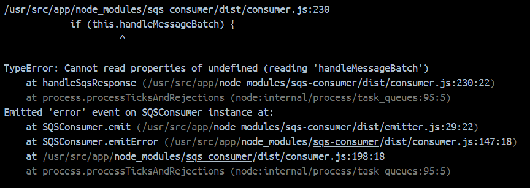
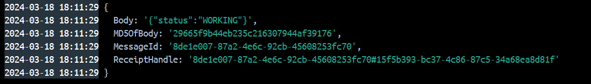

# MRE for sqs-consumer inheritance issue

There is an inheritance issue, that it's not possible to extend Consumer class. 

To reproduce this error I created 4 cases.
1. Both Producer and Consumer classes are extended
2. Producer class is extended while Consumer is not
3. Consumer class is extended while Producer is not
4. Both producer and Consumer are not extended

I expect errors on case1 and case3, because both cases includes extended Consumer class.

## Usage

```docker compose up -d --build```

## Results

case1 and case3 throws an error


case2 and case4 works properly


## Problem

It happens because you autoBind all propertyNames from constructor.prototype, so while extending these properties are not accessible anymore in this way.

## Solution

It's an example for [PR](https://github.com/bbc/sqs-consumer/pull/478).
